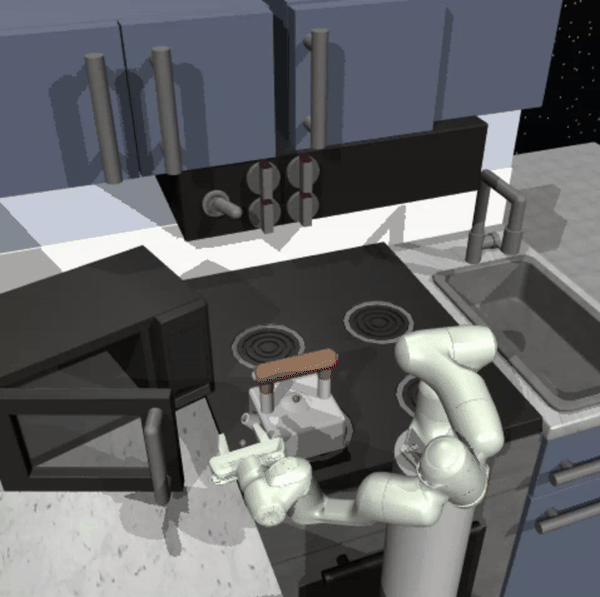

# franka-HRL  

**Solving Multi-Stage, Long-Horizon Robotic Tasks in the Franka Kitchen Gym Environment**  

This repository implements a hybrid **Imitation Learning (IL)** and **Reinforcement Learning (RL)** approach to address complex, multi-step robotic tasks in the sparse-reward environment of the Franka Kitchen. It integrates **human experiences** and **hierarchical learning** to enhance long-horizon task performance.  

---

## Key Features  
### 🛠 **Two-Phase Learning Approach**  
1. **Imitation Learning Phase**:  
   - Creating **goal-conditioned hierarchical policies** based on human demonstrations.  
   - Using a game controller interface to collect human-piloted robot actions for tasks like opening the microwave, building a comprehensive replay buffer.  
   - Weighted replay buffers prioritize human-generated experiences during early training stages.  

2. **Reinforcement Learning Phase**:  
   - Fine-tuning policies with the **Soft Actor-Critic (SAC)** algorithm for efficient long-horizon task performance.  
   - Dynamic reliance on human data ensures smooth transitions from imitation to independent policy learning.  

3. **Hierarchical Reinforcement Learning**:
    - Implementing a **meta-agent** to manage a static list of task-specific policies.  
    - Coordinating and loading the appropriate sub-policy to solve individual subtasks in a multi-task environment.  

---

### **Inspired By**:
This project is inspired by the paper:  
**[Relay Policy Learning: Solving Long-Horizon Tasks via Imitation and Reinforcement Learning](https://arxiv.org/abs/2012.13479)**  

